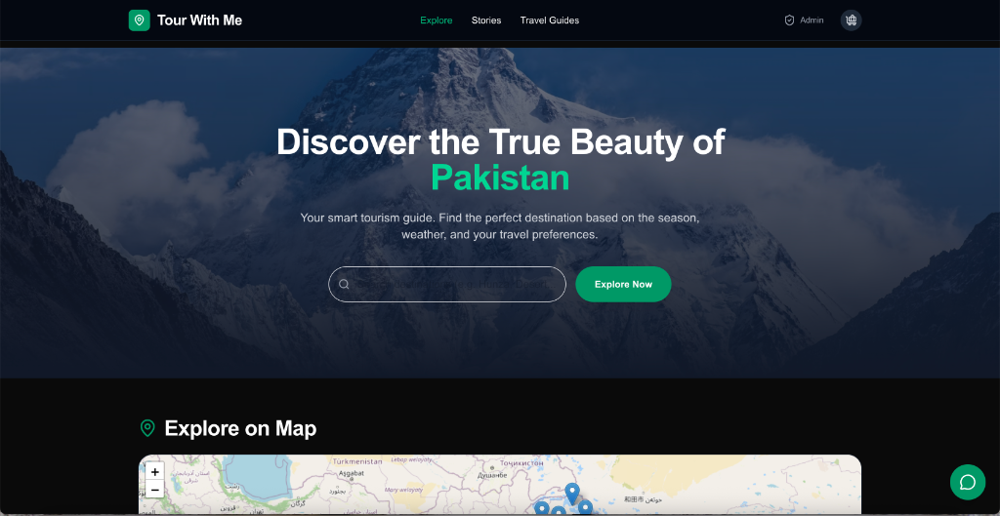
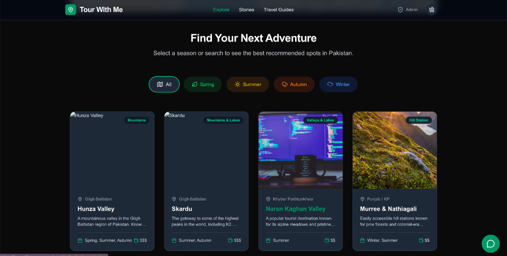
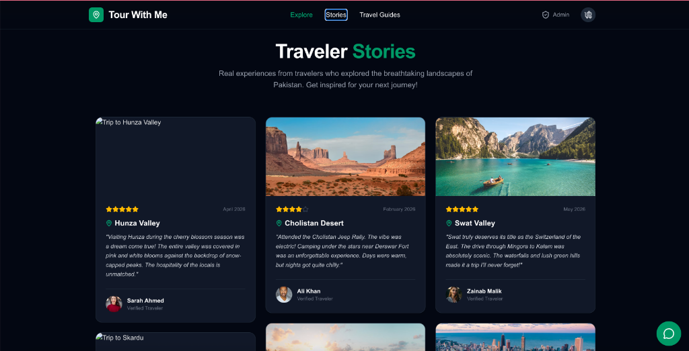
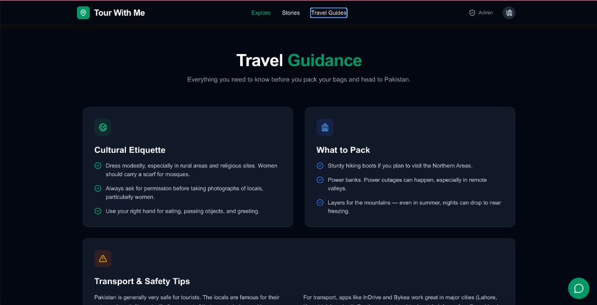

# Tour With Me 🏔️ 

> Your Ultimate AI-Powered Pakistan Tourism Guide

[](https://tour-with-me-nu.vercel.app/)

## 📝 About The Project

**Tour With Me** is a comprehensive, AI-integrated tourism platform designed to help local and international travelers explore the hidden gems of Pakistan. 

### The Problem It Solves
Planning a trip in Pakistan can be overwhelming. Information is often scattered across different blogs, seasonal weather changes drastically affect road accessibility (especially in the Northern Areas), and tourists struggle to find verified, up-to-date travel itineraries. 

**Tour With Me** solves this by centralizing all critical travel data (best seasons, estimated costs, travel tips, interactive maps) into one beautiful, easy-to-navigate web application. It also provides an intelligent **AI Travel Guide** to answer specific queries instantly, making trip planning effortless for solo travelers, families, and adventure enthusiasts.

---

## 🔗 Live Deployed URL

👉 **[Click Here to view the Live Application](https://tour-with-me-nu.vercel.app/)**

---

## ✨ Features

- **Interactive Destination Discovery**: Browse visually stunning destinations categorized by type (Mountains, Valleys, Coastal, Deserts) with real-time seasonal filtering.
- **Smart Search**: Instantly filter locations by name, region, or keywords.
- **My Itinerary Planner**: Add your favorite destinations to a local-storage powered itinerary planner so you never lose your trip goals.
- **Traveler Stories & Reviews**: Read verified feedback and stories from other tourists in a beautiful masonry grid layout.
- **Admin Dashboard**: Add new locations dynamically to the platform (stored locally).
- **Interactive Global Map**: View all destinations on a free, interactive OpenStreetMap powered by React Leaflet.
- **Comprehensive Details**: Each destination features an image gallery, weather info, cost estimations, and specific travel tips.

---

## 🤖 The AI Feature: "Tour With Me AI Guide"

### What it does:
The platform features a floating AI Assistant powered by Groq and LLaMA 3. It acts as a 24/7 personal travel agent. Users can ask about specific destinations, ask for seasonal recommendations (e.g., "Where should I go in December?"), or ask for budgeting tips. The AI provides fast, contextual, and polite responses.

### The System Prompt Behind It:
```text
You are "Tour With Me AI Guide", a friendly and knowledgeable Pakistan tourism assistant. You help travelers plan trips across Pakistan.

Key destinations you know about:
- Hunza Valley (Gilgit-Baltistan) - Cherry blossoms in spring, autumn colors
- Skardu (Gilgit-Baltistan) - K2 base camp, Shangrila, Deosai Plains
- Naran Kaghan (KPK) - Lake Saif-ul-Malook, Babusar Top
- Murree & Nathiagali (Punjab/KP) - Hill stations, pine forests, snow
- Karachi (Sindh) - Beaches, food, Clifton, Burns Road
- Cholistan Desert (Punjab) - Derawar Fort, camel safaris, jeep rally
- Islamabad (Capital) - Margalla Hills, Faisal Mosque, Monal
- Swat Valley (KPK) - "Switzerland of East", Malam Jabba skiing

Guidelines:
- Keep responses concise (2-3 sentences max)
- Be enthusiastic and helpful
- Recommend best seasons for each place
- Give practical tips (food, transport, budget)
- Use a warm, conversational tone
- If asked something unrelated to Pakistan tourism, gently redirect the conversation back to travel.
```

---

## 🛠️ Tools, Services, and Technologies Used

- **Framework**: Next.js 14 (App Router)
- **Styling**: Tailwind CSS & Framer Motion (for smooth micro-animations)
- **State Management**: Zustand (for the global Itinerary store)
- **Maps**: React Leaflet (OpenStreetMap integration)
- **Icons**: Lucide React
- **AI Model**: Meta LLaMA 3 (via **Groq API** for lightning-fast inference)
- **Deployment**: Vercel

---

## 📸 Screenshots

### 1. Home Page & Interactive Map


### 2. Discover Destinations


### 3. Traveler Stories


### 4. Travel Guides & Tips


---

## 🚀 How to Run the Project Locally

To run this project on your local machine, follow these steps:

1. **Clone the repository:**
   ```bash
   git clone https://github.com/Fariakhan12345/tour-with-me.git
   cd tour-with-me
   ```

2. **Install dependencies:**
   ```bash
   npm install
   ```

3. **Set up Environment Variables:**
   Create a `.env.local` file in the root directory and add your Groq API key:
   ```env
   GROQ_API_KEY=your_api_key_here
   ```

4. **Run the development server:**
   ```bash
   npm run dev
   ```

5. **Open your browser:**
   Navigate to [http://localhost:3000](http://localhost:3000) to see the application running.
